# PERO QUÉ ES ESTO DE ESTIMAR {data-background-image="assets/images/nest.jpg" data-background-opacity="0.18"}

## ¿Saben estimar los pájaros? {data-background-image="assets/images/nest.jpg" data-background-opacity="0.18"}

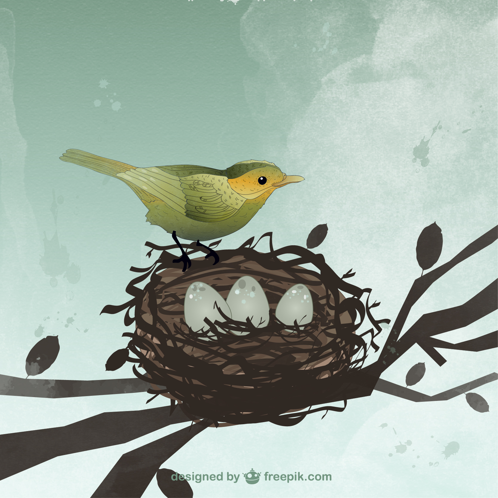{width=50%}  

Muchos tipos de pájaros se dan cuenta de que falta un huevo en su nido.

## Esto de antes se llama subitización, pero...  {data-background-image="assets/images/nest.jpg" data-background-opacity="0.18"}

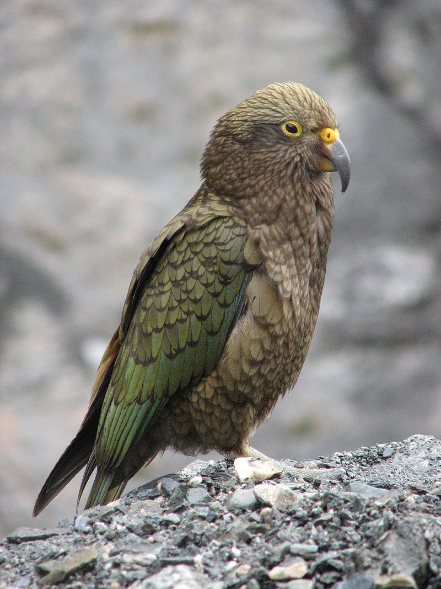{width=30%}  

Hay estudios que señalan que los loros son capaces de contar hasta 6.

## {data-background-image="assets/images/nest.jpg" data-background-opacity="0.18"}

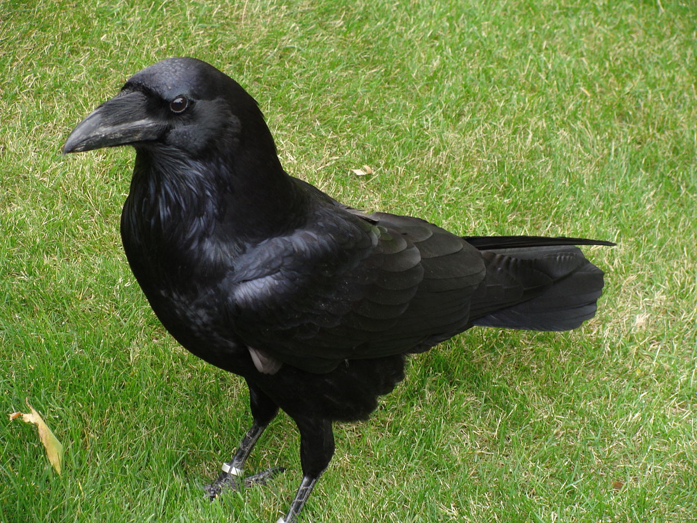{width=60%}  

Y los cuervos, ¡hasta 8!

## ¿Y las plantas? {data-background-image="assets/images/nest.jpg" data-background-opacity="0.18"}

. . .

:::::::::::::: {.columns}

::: {.column width="45%"}

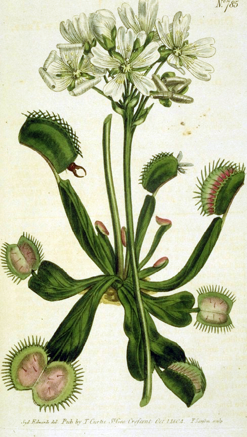{width=60%}  

:::

::: {.column width="45%"}

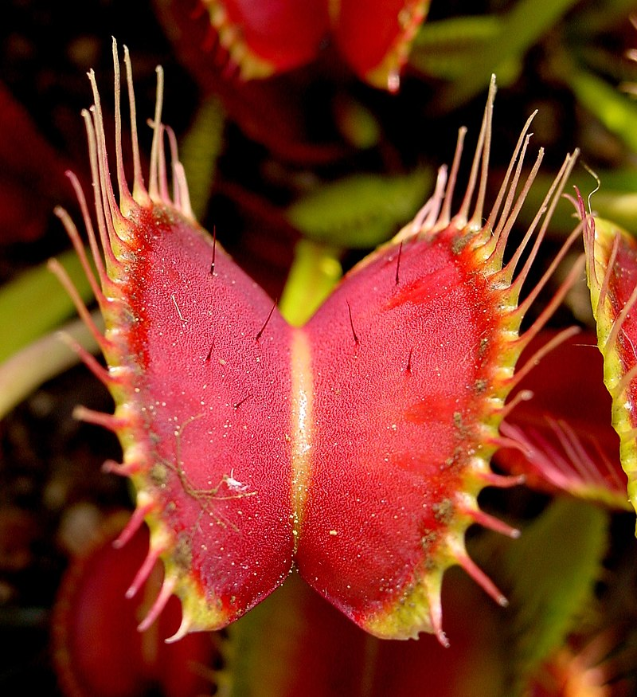{width=90%}  

:::
:::::::::::::

Dionaea muscipula (_atrapamoscas_)

# ¿Mejores que los pájaros?

##

 

##

##

 

##

##

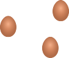 

##

##

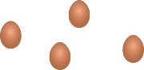 

##

##

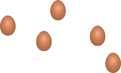 

##

##

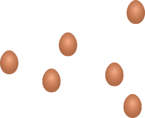 

##

##

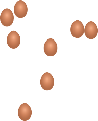 

##

##

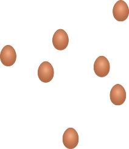 

##

## ¿Así es más fácil?

 

## ¿Y otras colecciones de objetos?{data-background-image="assets/images/grullas3.jpg" data-background-opacity="0.18"}

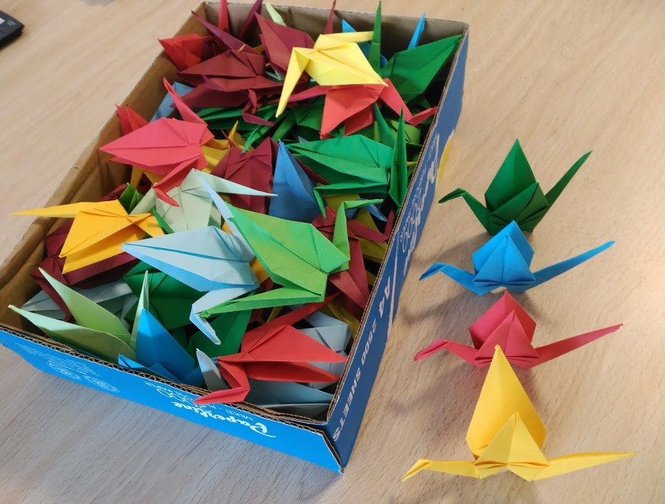{width=80%}  

:::notes

Esta serie de actividades está para que los alumnos hagan una estimación a ojo. Se lo tienen que apuntar para contrastar con lo que obtengan al final de la sesión.

:::

## Las canicas en el bote {data-background-image="assets/images/grullas3.jpg" data-background-opacity="0.18"}

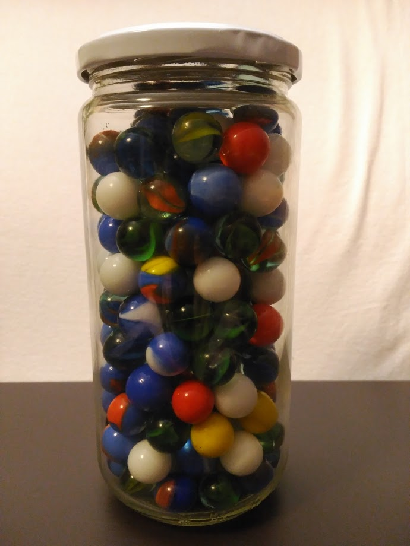{width=45%} 

## Las canicas en el bote (segundo intento) {data-background-image="assets/images/grullas3.jpg" data-background-opacity="0.18"}

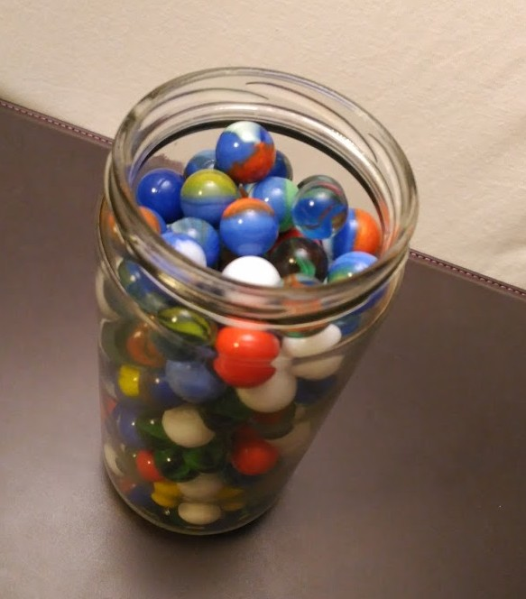{width=50%} 

:::notes

:::

## Los caramelos {data-background-image="assets/images/grullas3.jpg" data-background-opacity="0.18"}

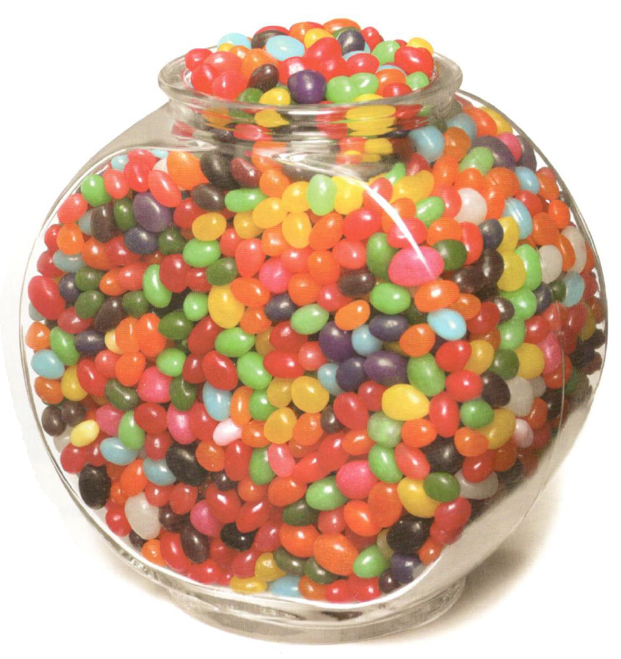{width=50%} 

Fuente: _Great Estimations_ (Bruce Goldstone)

:::notes

2464

:::

## El arroz {data-background-image="assets/images/grullas3.jpg" data-background-opacity="0.18"}

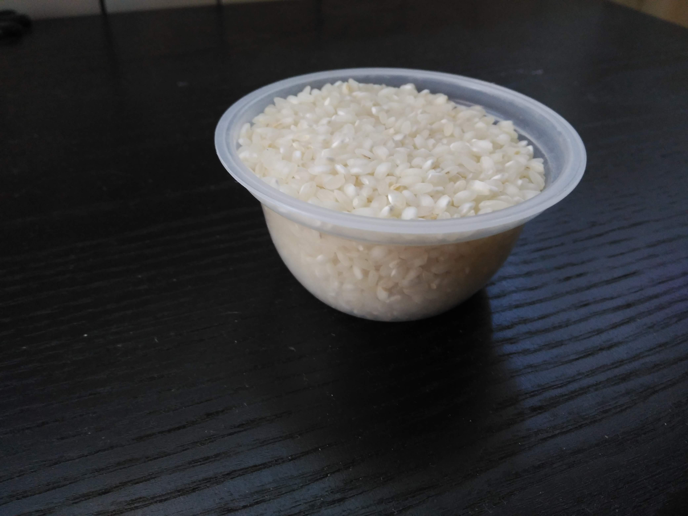{width=80%}  

# CYBERCHASE

## Un día nevado para ser exactos

[Enlace al vídeo completo en YouTube](https://www.youtube.com/watch?v=oyDHfN4t3cg)

:::::::::::::: {.columns}

::: {.column width="45%"}

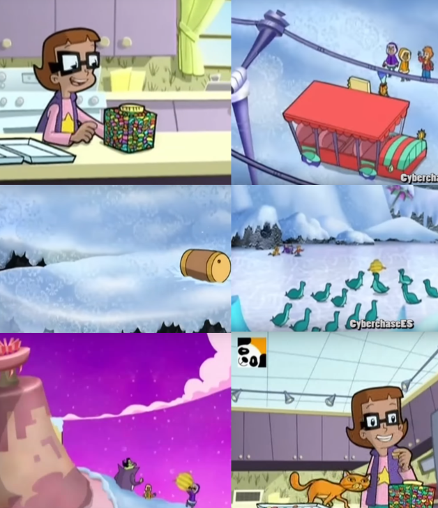{width=90%}  

:::

::: {.column width="45%"}

_Enlaces a cada escena_

[Caramelos 1](https://www.youtube.com/watch?v=oyDHfN4t3cg#t=3m00s) 

[Telesilla](https://www.youtube.com/watch?v=oyDHfN4t3cg#t=5m34s)   

[Barriles](https://www.youtube.com/watch?v=oyDHfN4t3cg#t=10m40s)   

[Focas](https://www.youtube.com/watch?v=oyDHfN4t3cg#t=16m00s)      

[Basket](https://www.youtube.com/watch?v=oyDHfN4t3cg#t=18m40s)     

[Caramelos 2](https://www.youtube.com/watch?v=oyDHfN4t3cg#t=20m30s)

:::

:::::::::::::

::: notes

Se trata de ver las escenas, parando antes de que las resuelvan los personajes, dando un poco de tiempo para que las piensen los alumnos.

:::

# Manos a la obra {data-background-image="assets/images/grullas3.jpg" data-background-opacity="0.18"}

## Las grullas {data-background-image="assets/images/grullas3.jpg" data-background-opacity="0.18"}

{width=80%}  

:::notes
66 grullas
:::

## Las canicas en el bote {data-background-image="assets/images/grullas3.jpg" data-background-opacity="0.18"}

{width=45%} 

## Las canicas en el bote (segundo intento) {data-background-image="assets/images/grullas3.jpg" data-background-opacity="0.18"}

{width=50%} 

:::notes

177 canicas

:::
## Los caramelos {data-background-image="assets/images/grullas3.jpg" data-background-opacity="0.18"}

{width=50%} 

Fuente: _Great Estimations_ (Bruce Goldstone)

:::notes

2464 caramelos

:::

## El arroz {data-background-image="assets/images/grullas3.jpg" data-background-opacity="0.18"}

{width=80%}  

:::notes
¿Realmente importa saber exactamente cuánto arroz hay?
Hay unos 2300.

:::

# ¿Tenemos superpoderes? {data-background-image="assets/images/fondo1.jpg" data-background-opacity="0.18"}

## ¿Cuánto mide...? {data-background-image="assets/images/fondo1.jpg" data-background-opacity="0.18"}

:::::::::::::: {.columns}

::: {.column width="45%"}

{width=90%}  

:::

::: {.column width="45%"}

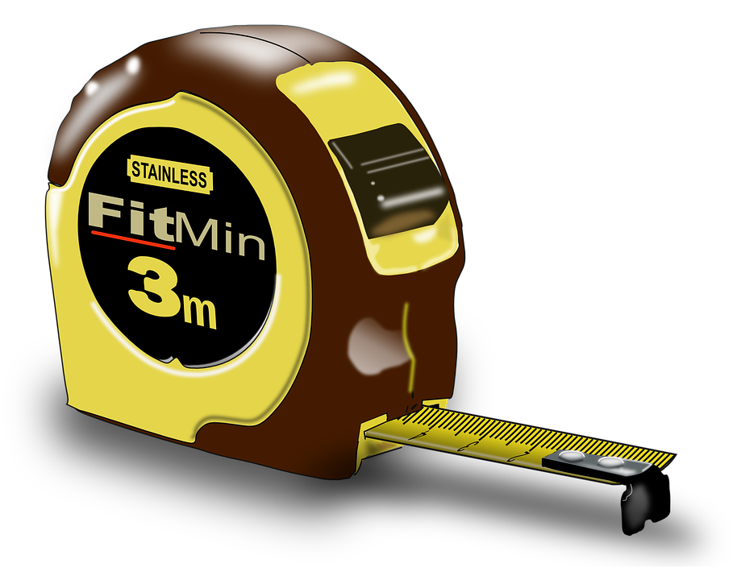{width=90%}  

:::

::::::::::::

::: notes

Intentamos medir diferentes longitudes, áreas y volúmenes en unidades no estándar, transformándolas también a unidades del SMD para ver cuánto nos alejamos.

:::

# Referencias y créditos {.credits}

##

En la elaboración de este material didáctico han participado:

- Pablo Beltrán-Pellicer

## Para saber más

Albarracín, L., Lorente, C., Lopera, A., Pérez, H., & Gorgorió, N. (2015). Problemas de estimación de grandes cantidades en las aulas de Educación Primaria. _Épsilon, 32_(89), 19-33. [Enlace](https://thales.cica.es/epsilon/sites/thales.cica.es.epsilon/files/%5Bfield_volumen-formatted%5D/epsilon89_2.pdf) 

Beltrán-Pellicer, P. (2018). Algunas tareas de estimación en series de dibujos animados. _EDMA0-6: Educación Matemática en la Infancia, 7_(2), 113-122. [Enlace](https://www.researchgate.net/publication/332523720_Algunas_tareas_de_estimacion_en_series_de_dibujos_animados)

Segovia, I., Castro, E., Castro, E., & Rico, L. (1989). _Estimación en cálculo y medida_. Madrid: Editorial Síntesis. 
 

##

Presentaciones y materiales realizados con  <a href="https://revealjs.com/#/">Reveal.js</a>, <a href="https://pandoc.org/">Pandoc</a>, <a href="https://www.latex-project.org/">LaTeX</a>, <a href="https://www.mathjax.org/">MathJax</a> y <a href="https://www.markdownguide.org/">Markdown</a>

Los derechos de las imágenes de Cyberchase pertenecen a la [PBS](https://pbskids.org/cyberchase/).

Otras imágenes utilizadas provienen de [freepik](https://www.freepik.es): [nido](https://www.freepik.es/fotos-vectores-gratis/arbol)

Y de [Wikipedia](https://www.wikipedia.org): [kea](https://commons.wikimedia.org/w/index.php?curid=1491465), [cuervo](https://commons.wikimedia.org/w/index.php?curid=4841560), [dionaea](https://es.wikipedia.org/wiki/Dionaea_muscipula#/media/File:Venus_Flytrap_showing_trigger_hairs.jpg)

##

_Compartir el conocimiento de forma libre es una buena práctica._

En estas diapositivas se han utilizado materiales disponibles en abierto y se han citado las fuentes correspondientes. El contenido de la presentación está publicado con licencia Creative Common [CC-BY-SA-4.0](https://creativecommons.org/licenses/by-sa/4.0/legalcode.es), lo que quiere decir que puedes compartirla y adaptarla, citándome (Pablo Beltrán-Pellicer) y poniendo un enlace a [https://pbeltran.github.io/superestimacion](https://pbeltran.github.io/superestimacion). 

_Siéntete libre de trabajar con este material y de contactar conmigo para compartir tus reflexiones._

